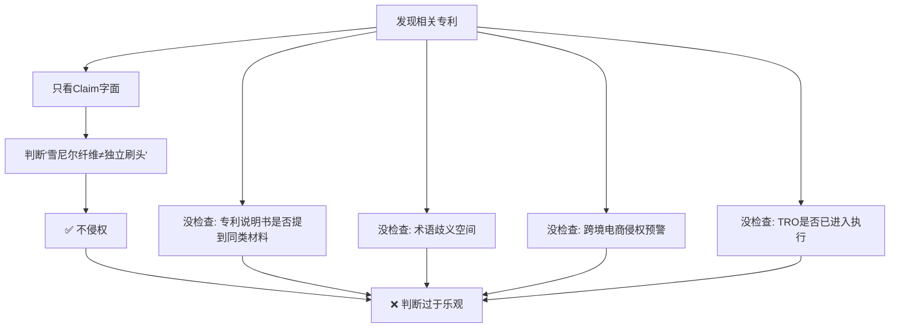

# 发明专利排查经验教训

> 来源：288-鞋子清洗袋（Deluvo）审查过程中的判断失误与纠正

---

## 事件回顾

| 阶段 | 判断 | 依据 |
|:----:|:----:|------|
| **首次判断** | 🟢 低风险 | 发现 TRO 24-cv-8946（US 10,086,410），但认为雪尼尔纤维是织物质地 ≠ 独立刷头，结构不同 |
| **用户追问后** | 🟡 **修正为中等风险** | 深入搜索后发现专利说明书明确提及雪尼尔织物，且跨境电商社区文章直接将其归类为侵权产品 |

## 失误根因

**核心问题链：**
1. 只读了 **claim 摘要**（nylon/silicone brushes），没读 **specification 全文**（明确写着 chenille fabric）
2. 对 "brush" 这个词做了**对自己有利的狭义解释**，没考虑法院可能做宽泛解释
3. 发现了 TRO 案件但没进一步查 "这个 TRO 到底是针对哪类产品执行的" 
4. 没搜 **中文跨境电商文章**——这些文章反映的是**市场实际执行动态**

## 工作流改进

已更新到 [[CLAUDE.md]] 第四层和第五层，新增：

### 第四层新增步骤
- **专利语义核查**：检查关键术语的宽泛解释可能性
- **专利说明书交叉核查**：说明书是否提到本产品同类材料/结构
- **TRO 侵权预警检索**：搜索专利号 + 跨境电商社区，确认执行历史

### 跨层风险增强规则
1. **TRO 增强规则**：有执行历史的专利风险自动至少提升一级
2. **术语歧义规则**：存在宽泛解释空间的术语应标记为 🟡 争议项
3. **跨境电商动态规则**：侵权预警文章比法律文本更贴近实操风险

## Checklists 自查

### 发现发明专利后，必须完成的6项检查

- [ ] 1. Claim Chart：逐项比对（基础，但不充分）
- [ ] 2. **说明书核查**：specification 是否提到与本产品相同的材料/结构？
- [ ] 3. **术语歧义评估**：关键术语有几种可能的解释？对我有利还是不利？
- [ ] 4. **TRO/诉讼状态**：用专利号搜 `"专利号" + TRO / lawsuit / injunction`
- [ ] 5. **跨境电商预警**：用关键词搜 Chinese cross-border e-commerce patent warning 文章
- [ ] 6. **执行力度判断**：该专利是"沉睡专利"还是"正在执行的专利"？

---

## 关联页面

- [[288-鞋子清洗袋]] — 触发此反思的实际产品审查
- [[CLAUDE.md]] — 已更新的工作流规则
- [[wiki/sources/2026-06-03-专利与侵权风险排查SOP]] — 五层框架 SOP
